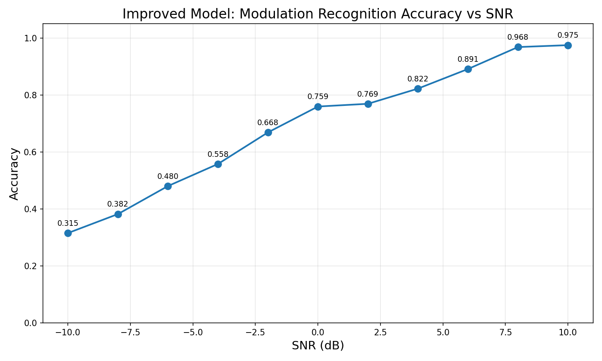
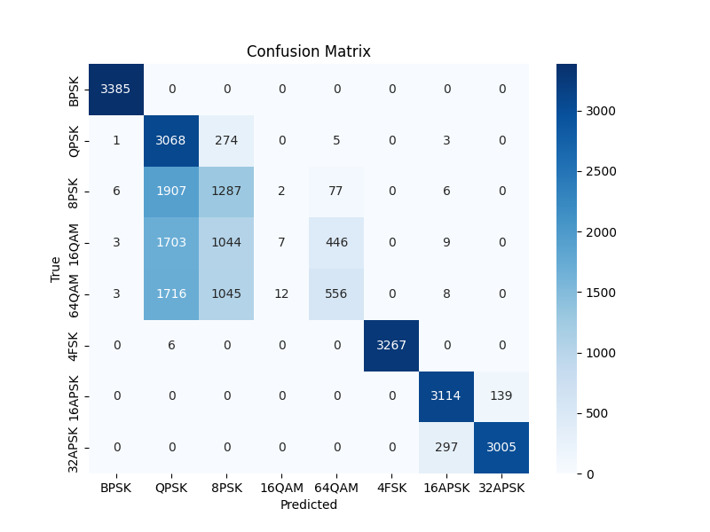
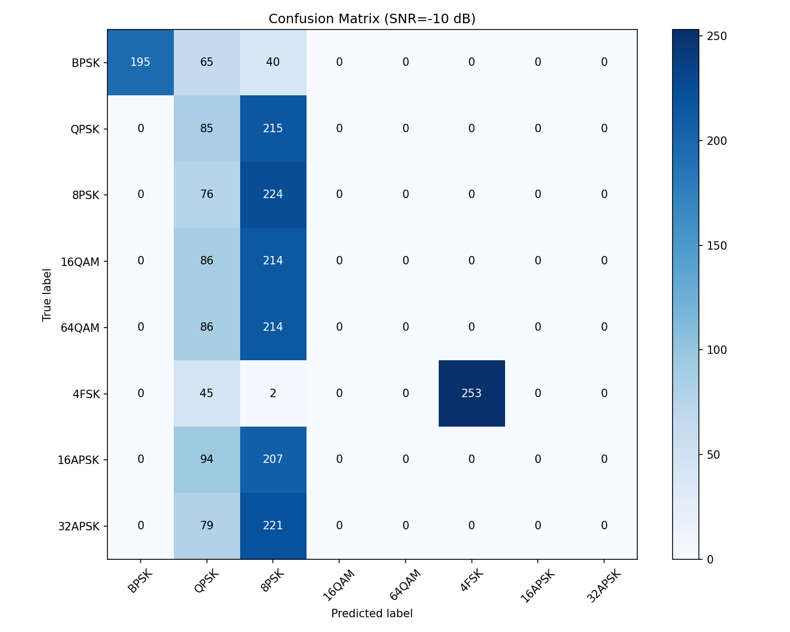
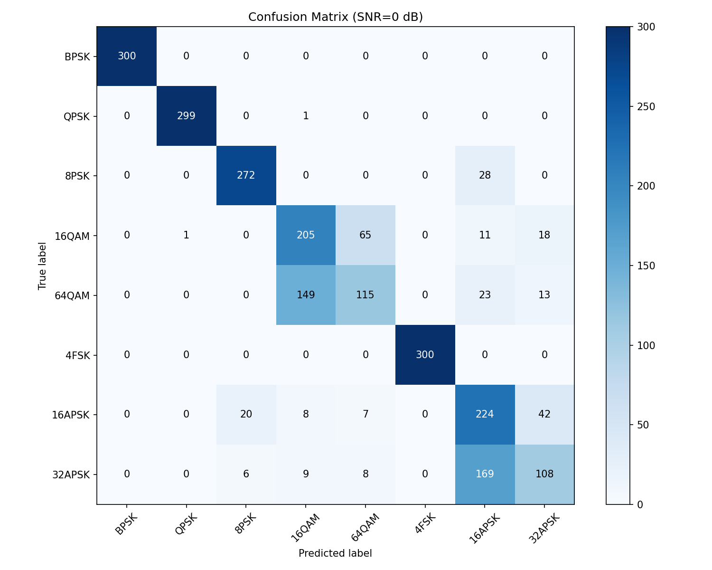
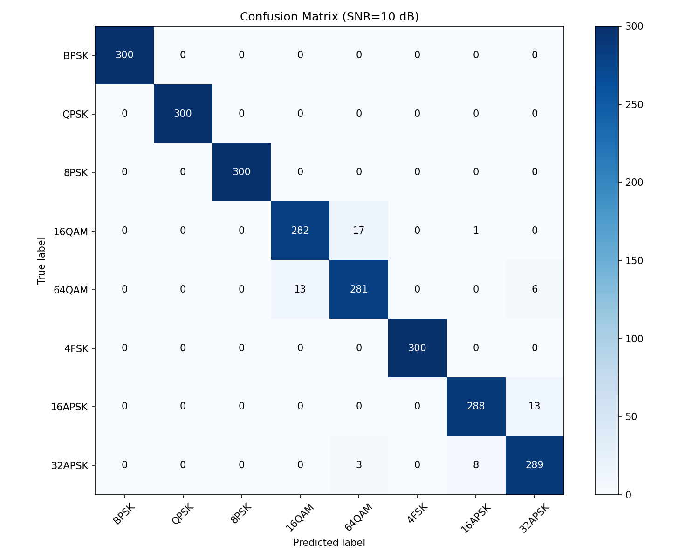

# 调制识别系统 (Modulation Recognition)

基于深度学习的数字调制方式自动识别系统，使用多尺度卷积与双向 LSTM 混合网络对 I/Q 信号进行 8 种调制方式的分类识别。



## 项目概述

本项目利用 PyTorch 构建深度学习模型，对通信信号的 I/Q 采样数据进行调制方式识别。支持在 **-10 dB 到 10 dB** 信噪比范围内对 8 种数字调制信号进行分类。

### 支持的调制类型

| 类别 | 名称 |
|------|------|
| BPSK | 二进制相移键控 |
| QPSK | 四进制相移键控 |
| 8PSK | 八进制相移键控 |
| 16QAM | 16 进制正交幅度调制 |
| 64QAM | 64 进制正交幅度调制 |
| 4FSK | 四进制频移键控 |
| 16APSK | 16 进制幅度相移键控 |
| 32APSK | 32 进制幅度相移键控 |

## 网络架构

模型采用 **ImprovedMultiScaleLSTM** 混合架构，融合多尺度卷积特征与时序特征：

```
输入 I/Q 信号 (2 × 1024)
    │
    ├── InstanceNorm (样本级归一化)
    │
    ├── ═══ 卷积分支 1 (细尺度) ═══
    │   Conv1D(k=3) → BN → ReLU → Conv1D(k=3) → BN → ReLU → GlobalAvgPool
    │
    ├── ═══ 卷积分支 2 (中尺度) ═══
    │   Conv1D(k=7) → BN → ReLU → Conv1D(k=5) → BN → ReLU → GlobalAvgPool
    │
    ├── ═══ 卷积分支 3 (粗尺度) ═══
    │   Conv1D(k=15) → BN → ReLU → Conv1D(k=7) → BN → ReLU → GlobalAvgPool
    │
    ├── ═══ LSTM 路径 ═══
    │   Conv1D(k=4, s=4) → Bi-LSTM(2层) → 时间步平均
    │
    └── 特征拼接 (64×3 + 128 = 320维)
        └── FC(256) → BN → Dropout → FC(128) → Dropout → FC(8)
```

- 每个卷积分支使用 **2 层卷积**，构建层次化特征
- **双向 LSTM** 捕获序列依赖关系，使用所有时间步的均值
- **余弦退火** 学习率调度 + 梯度裁剪
- **混合精度训练** (AMP) 加速
- **早停机制** (patience=15) 防止过拟合

## 环境要求

- Python 3.8+
- PyTorch 2.7+ (CUDA 可选，支持自动回退到 CPU)
- 详见 `requirements.txt`

### 安装

```bash
# 克隆仓库
git clone https://github.com/Dongzhi9/Modulation-Recognition.git
cd Modulation-Recognition

# 安装依赖
pip install -r requirements.txt
```

## 数据集

数据以 MATLAB `.mat` 格式存储，目录结构如下：

```
matlab/
├── BPSK/        # 每个.mat文件包含 data_batch(N×2048) 和 snr_labels
├── QPSK/
├── 8PSK/
├── 16QAM/
├── 64QAM/
├── 4FSK/
├── 16APSK/
└── 32APSK/
```

- 每个 `.mat` 文件包含 `data_batch`（I/Q 样本矩阵，shape: N×2048）和 `snr_labels`（信噪比标签）
- 每行包含 I、Q 两路信号，长度为 1024 个采样点（共 2048 列）
- 信噪比范围：-10 dB 到 10 dB（步进 2 dB）

### 数据可视化

```bash
python check_dataset.py
```

可以查看不同调制方式的 I/Q 散点图。



## 使用方法

### 训练模型

每个 SNR 单独训练一个模型，自动分层采样（70% 训练 / 30% 测试）：

```bash
python train_improved.py
```

训练过程会自动：
1. 加载 MATLAB 数据并做 RMS 功率归一化
2. 对每个 SNR（-10 dB ~ 10 dB）分别训练
3. 保存每个 SNR 下的最佳模型为 `improved_model_snr{X}.pth`
4. 生成各类 SNR 下的混淆矩阵图片
5. 绘制准确率-SNR 曲线图

### 训练特性

- **分层采样**：每个 SNR 下各类别比例保持一致
- **早停**：验证准确率连续 15 轮不提升则停止
- **梯度裁剪**：`max_norm=5.0` 防止梯度爆炸
- **余弦退火学习率调度**
- **混合精度训练** (`torch.amp`) 加速训练

## 评估结果

### 各 SNR 准确率


### 混淆矩阵（示例）

| SNR = -10 dB | SNR = 0 dB | SNR = 10 dB |
|:---:|:---:|:---:|
|  |  |  |

高阶调制（16QAM、64QAM、16APSK、32APSK）在低信噪比下区分难度较大，模型在中等以上 SNR 条件下表现良好。

## 项目结构

```
├── train_improved.py      # 改进版训练主脚本（多尺度CNN + Bi-LSTM）
├── check_dataset.py       # 数据集查看脚本（I/Q散点图）
├── requirements.txt       # Python 依赖
├── matlab/
│   ├── BPSK/ ~ 32APSK/    # 调制信号数据集
│   └── untitled.m         # MATLAB 辅助脚本
├── improved_acc_vs_snr.png  # 准确率-SNR 曲线
├── cm_snr*.png              # 各 SNR 混淆矩阵
└── improved_model_snr*.pth  # 训练好的模型权重（已gitignore）
```

## 许可证

MIT License
